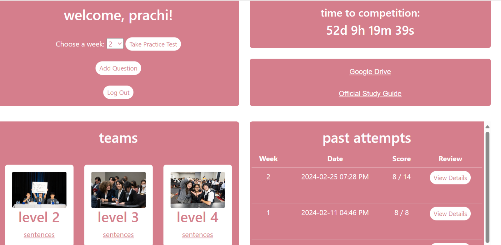
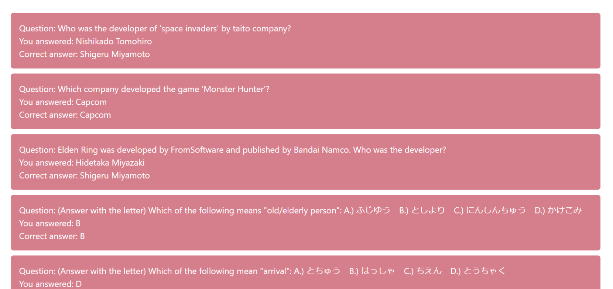

# jballin
JBowl app endeavors in summer 2023
At this point it is working with:
- User authentication with database of user list and registration option.
- Homepage of login with option to either add question(mentioned above) WITH DB or take quiz consisting of added questions.
  (Note: "sentences" for each level links to a google doc with sample practice sentences for the individual spoken round of the competition!)  
- Returns score & summary after every time someone logs in and takes quiz 
- Multiple users can log on and take quiz simultaneously(multiple sessions)
- Log out button that redirects to login page

